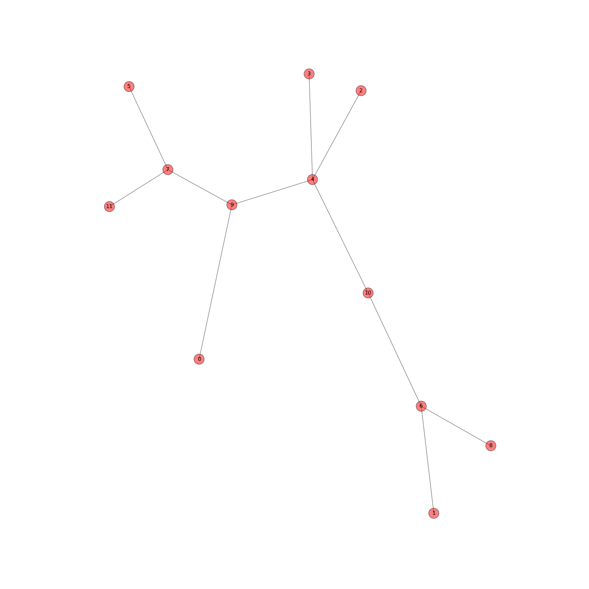
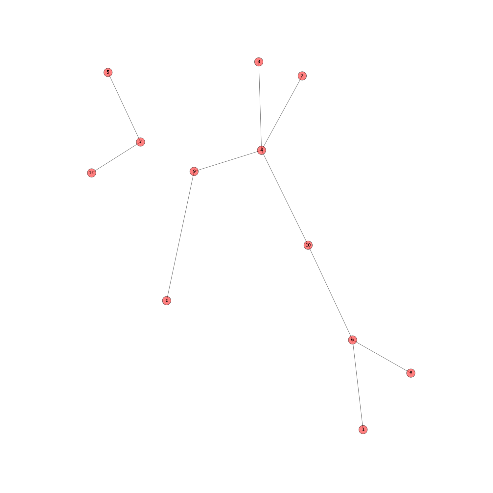
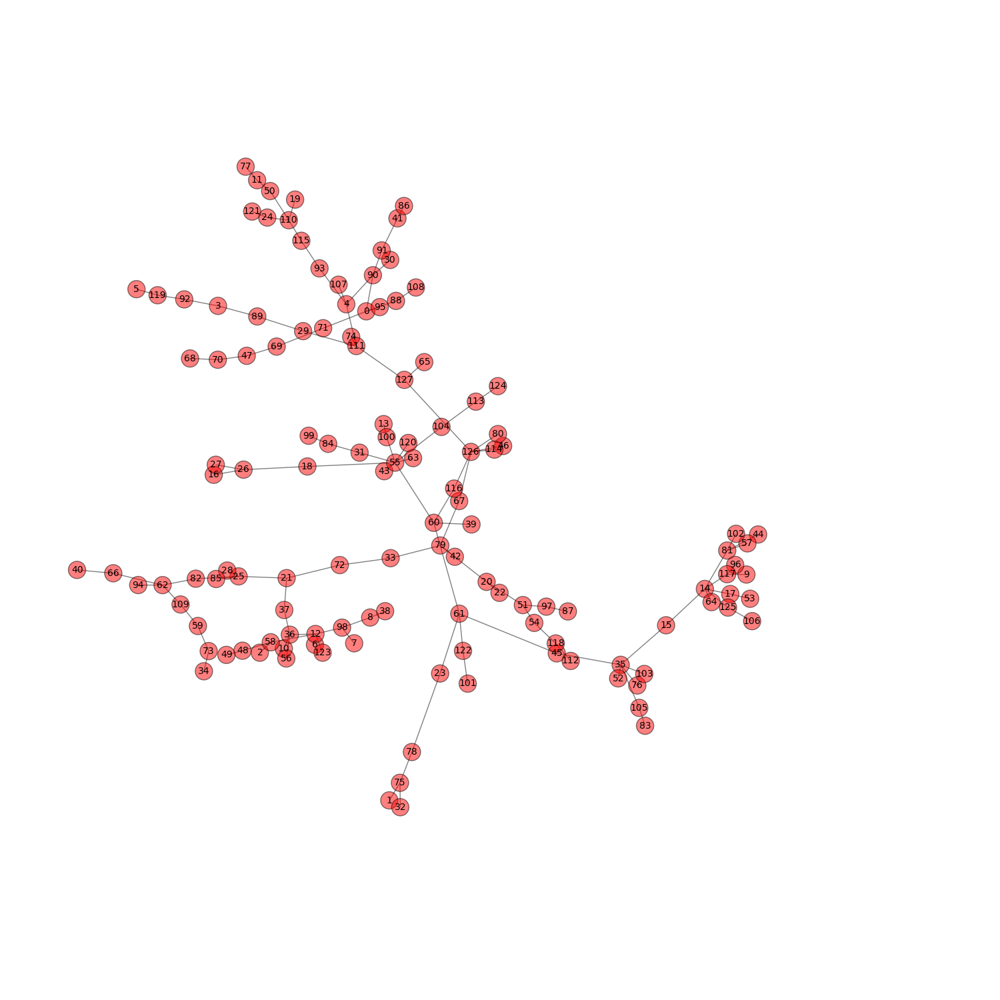

# T2: Árvores geradoras mínimas e comunidades
Cada grupo deve escolher um dataset específico (grafo ponderado armazenado em arquivo .gml, .graphml, .txt, .net, etc) e implementar o algoritmo de Prim para extrair uma Minimum Spanning Tree (MST) de G.

## METODOLOGIA

Após a implementação do algoritmo e a extração da MST, a forma mais trivial de obter grupos ou comunidades de nós consiste em isolar conjuntos de vértices através da remoção de arestas da MST. Para isso, nesse trabalho utilizaremos 2 critérios distintos:

a) remover as k-1 maiores arestas da árvore para gerar k agrupamentos
b) utilizar a medida conhecida de corte abaixo como critério de seleção da aresta a ser removida. Deve ser removida a aresta que maximiza a seguinte medida:

w(A,B) x min{ Na, Nb }

onde w(A,B) é o peso da aresta que liga os vértices A e B, Na é o número de vértices no grupo A e Nb é o número de vértices no grupo B (pois qualquer aresta removida de uma árvore gerará exatamente 2 grupos, A e B)

## QUESTIONAMENTOS

1) Obtenha as comunidades resultantes em cada caso:
a) utilize o critério a) com K = 2 e K = 5
b) utilize o critério b) para obter 2 comunidades
c) utilize o critério b) para obter 5 comunidades

## RESPOSTAS

1-a)
Foram utilizados 3 datasets: uk12, wg59 e sgb128. A seguir Veremos os grafos originais, a remoção de arestas de K=2 e em seguida de K=5

Dataset UK12 original

Critério de remoção K=2

Critério de remoção K=5

Dataset WG59 original

Critério de remoção K=2

Critério de remoção K=5

Dataset SGB128 original

Critério de remoção K=2

Critério de remoção K=5

1-b)

1-c)