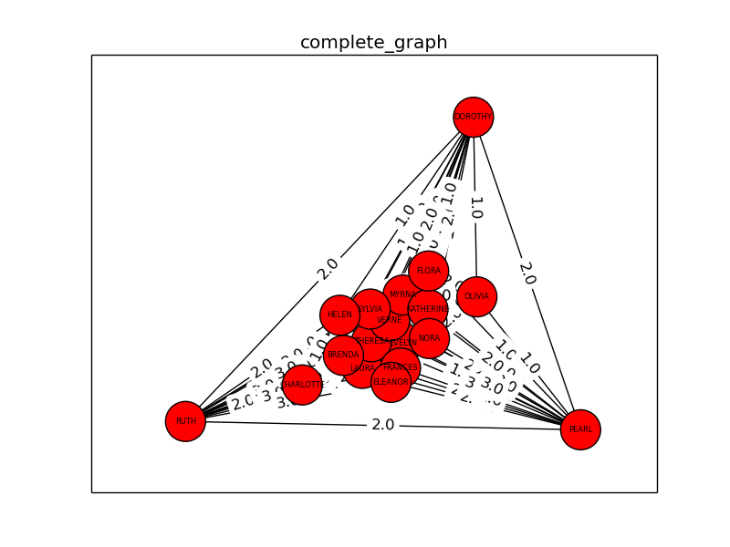
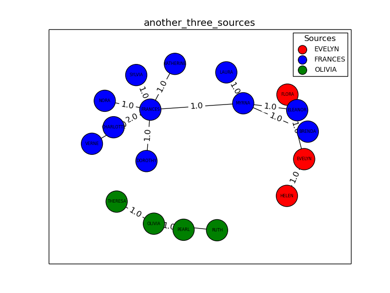

# Trabalho 3:  Árvores de caminhos ótimos em grafos e o problema da classificação supervisionada

Este trabalho consiste na implementação e aplicação do algoritmo de Dijkstra para obtenção de árvores de caminhos ótimos.
Foi desenvolvido em Python utilizando a biblioteca NetworkX.
O código está todo comentado, portanto não há necessidade de reexplicá-lo aqui - basta ler o código para entendê-lo.

O grafo escolhido representa a participação de 18 mulheres em eventos sociais.
O peso das arestas indica a quantidade de eventos que duas mulheres participaram juntas.
O grafo foi retirado deste [repositório de datasets](http://toreopsahl.com/datasets/#southernwomen).

## Grafo completo

## Questionamentos

### a) Resultado obtido para 2 agrupamentos a partir de duas sementes distantes uma da outra

 Para obter as sementes, escolhemos vértices da periferia do grafo. O resultado é o seguinte:

### b) Resultado obtido para 3 agrupamentos com sementes escolhidas aletoriamente

### c) Repetir o item b)

Repare que as árvores geradas não são iguais à do item anterior