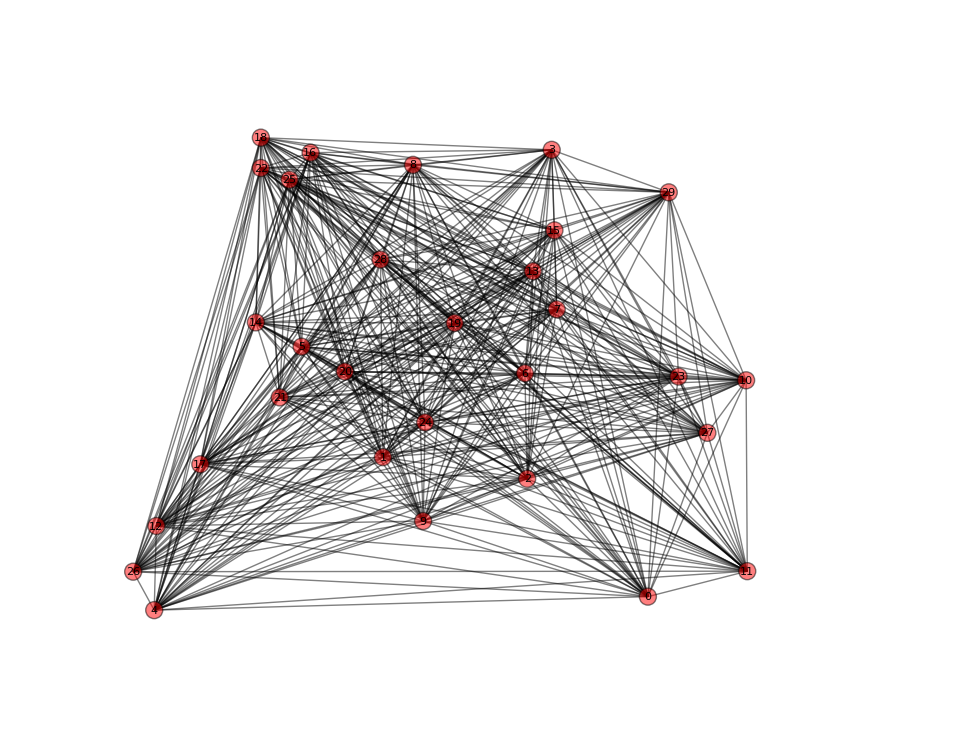

# T4 - Opção a): O Problema do Caixeiro Viajante
O programa deve ler um grafo Hamiltoniano ponderado a partir de um arquivo qualquer e através de um algoritmo visto em sala (2-otimal ou Twice-Around) obter 10 soluções diferentes para o problema do caixeiro-viajante.

## METODOLOGIA

Para obter soluções distintas para o problema há algumas heurísticas comumente adotadas na prática: utilizar diferentes inicializações, ou seja, soluções iniciais. Elas podem ser geradas simplesmente aleatoriamente (selecionando vértices quaisquer) ou utilizando alguma heurística, como por exemplo a escolha do vizinho mais próximo por exemplo. Dessa forma, escolhe-se aleatoriamente apenas o primeiro vértice do ciclo (v0) e depois sempre é escolhido como próximo elemento da sequência o vizinho mais próximo do vértice atual, até que o ciclo Hamiltoniano seja formado (não sobre mais vértices). 

OBS: Em caso de implementação do algoritmo Twice-Around utilize alguma função presente na biblioteca NetworkX para a geração de circuitos Eulerianos (que implemente o algoritmo de Fleury ou uma variante). Isso facilita significativamente o desenvolvimento.

### QUESTIONAMENTOS

Liste as 3 melhores soluções e as 3 piores obtidas. Qual a diferença de custo entre a melhor e a pior? Discuta como a diferença pode ser significativa.

#### RESPOSTAS

Considere o grafo a seguir de 30 vértices (HA30):

Foi implementado algoritmo Twice-Around-the-Tree, ou apenas Twice-Around, com uma implementação própria do algoritmo de Prim. Vale a pena ressaltar que o algoritmo do Twice-Around pode ser descrito da seguinte forma:
    
    1- Extrair a Árvore Geradora Mínima do grafo G (Prim ou Kruskal, foi utilizado o algoritmo de Prim)
    2-
        a- Duplicar as arestas para a extração do ciclo euleriano de origem aleatória
        b- Aplicação de um algoritmo de extração de um ciclo euleriano
    3- Remover os vértices repetidos do caminho.
    
Abaixo temos o resultado de 10 soluções aleatorizadas.

Caminho: [27, 29, 13, 8, 28, 14, 3, 1, 5, 10, 23, 2, 21, 12, 0, 16, 19, 7, 26, 11, 24, 9, 18, 15, 20, 25, 4, 22, 6, 17]

Peso: 806.0

Caminho: [1, 5, 10, 23, 2, 21, 12, 0, 16, 19, 7, 26, 11, 24, 9, 18, 15, 20, 25, 4, 22, 6, 17, 3, 27, 29, 13, 8, 28, 14]

Peso: 806.0

Caminho: [14, 28, 8, 13, 27, 29, 3, 1, 5, 10, 23, 2, 21, 12, 0, 16, 19, 7, 26, 11, 24, 9, 18, 15, 20, 25, 4, 22, 6, 17]

Peso: 806.0

Caminho: [5, 10, 23, 2, 21, 12, 0, 16, 19, 7, 26, 11, 24, 9, 18, 15, 20, 25, 4, 22, 6, 17, 1, 3, 27, 29, 13, 8, 28, 14]

Peso: 806.0

Caminho: [11, 26, 7, 19, 16, 0, 12, 21, 2, 23, 10, 5, 1, 3, 27, 29, 13, 8, 28, 14, 17, 18, 15, 20, 25, 4, 22, 6, 24, 9]

Peso: 806.0

Caminho: [5, 10, 23, 2, 21, 12, 0, 16, 19, 7, 26, 11, 24, 9, 18, 15, 20, 25, 4, 22, 6, 17, 1, 3, 27, 29, 13, 8, 28, 14]

Peso: 806.0

Caminho: [7, 26, 11, 24, 9, 19, 16, 0, 12, 21, 2, 23, 10, 5, 1, 3, 27, 29, 13, 8, 28, 14, 17, 18, 15, 20, 25, 4, 22, 6]

Peso: 806.0

Caminho: [10, 23, 2, 21, 12, 0, 16, 19, 7, 26, 11, 24, 9, 18, 15, 20, 25, 4, 22, 6, 17, 5, 1, 3, 27, 29, 13, 8, 28, 14]

Peso: 806.0

Caminho: [24, 26, 7, 19, 16, 0, 12, 21, 2, 23, 10, 5, 1, 3, 27, 29, 13, 8, 28, 14, 17, 18, 15, 20, 25, 4, 22, 6, 11, 9]

Peso: 806.0

Caminho: [27, 29, 13, 8, 28, 14, 3, 1, 5, 10, 23, 2, 21, 12, 0, 16, 19, 7, 26, 11, 24, 9, 18, 15, 20, 25, 4, 22, 6, 17]

Peso: 806.0

É possível notar que os caminhos são na sua maioria diferentes, devido ao método de randomização ter escolhido múltiplas vezes o nó 5 e o nó 27 para começar o caminho.

Também é notável e curioso que os pesos de todos os caminhos sejam iguais, e isso se dá pelo motivo de que o algoritmo de Prim considera a menor aresta dos nós descobertos para os nós que são possíveis de se chegar. E por isso a Árvore Geradora Mínima foi a mesma e os valores são os mesmos.

Para que os valores sejam diferentes, é imperioso utilizar um outro método para a extração das MST.